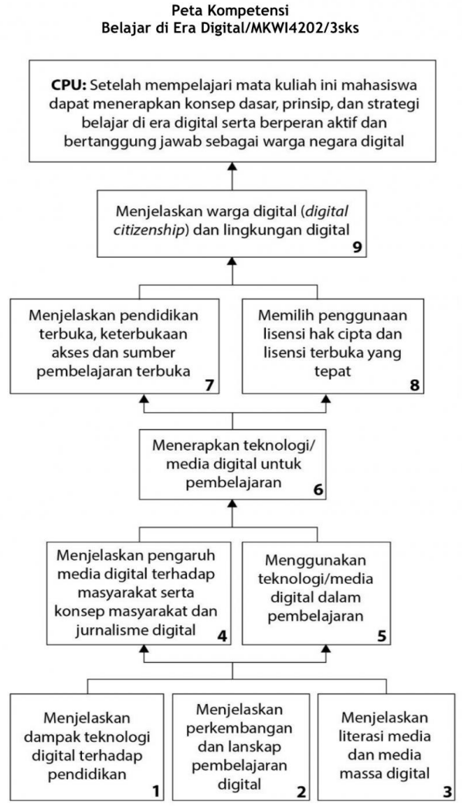

# Belajar di Era Digital

Mata kuliah MKWI4202 Belajar di Era Digital yang berbobot 3 (tiga) SKS ini berisi materi tentang konsep, prinsip, aplikasi praktis yang berkaitan dengan apa dan bagaimana pembelajaran di era digital. Seluruh materi Belajar di Era Digital merupakan hasil adaptasi dari materi pembelajaran “Learning in Digital Age (LIDA 101-104) yang dikelola oleh OERu [https://oeru.org/](https://oeru.org/) dengan lisensi CC BY SA dan adaptasi dari beberapa materi yang ada di buku “Teaching in Digital Age” karangan Tony Bates  yang berlisensi CC BY NC.

Materi ini wajib dipahami oleh seluruh mahasiswa Universitas Terbuka. Mengapa demikian? Pada pembelajaran abad 21 dimulai dengan sebuah inovasi yang sering disebut dengan pembelajaran digital, online atau pembelajaran daring yang pada prinsipnya mengacu pada pembelajaran dengan berbantuan teknologi. Seiring dengan perkembangan teknologi informasi dan komunikasi yang sangat pesat, metode dan prinsip pembelajaran pun di perguruan tinggi juga mengalami perkembangan khususnya terkait dengan literasi digital dan informasi mahasiswa. Literasi digital dan informasi sangat penting bagi mahasiswa sebagai salah satu prasyarat untuk menjadi bagian dari masyarakat abad 21 yang sarat dengan penggunaan teknologi digital.

Pada awal modul Anda akan mempelajari perkembangan perguruan tinggi di abad 21 khususnya terkait dampak perkembangan teknologi terhadap tuntutan komptensi dan kualifikasi SDM yang tentunya juga berpengaruh terhadap perguruan tinggi. Kemudian Anda akan mempelajari apa dampak dari tuntutan kompetensi digital tersebut pada modul modul modul selanjutnya. Anda juga akan mempelajari bagaimana pendidikan terbuka sebagai salah satu prinsip pendidikan yang semakin berkembang. Pendidikan terbuka menjadi sangat relevan dikarenakan didasari oleh budaya berbagi pengetahuan (the culture of knowledge sharing) yang merupakan budaya masyarakat di era digital. Pada akhir modul Anda akan mempelajari prinsip dan etika sebagai warga digital yang aktif, dan bertanggungjawab serta dapat melindungi diri Anda dari pelanggaran atau kejahatan digital.

## Konsep dan Prinsip Belajar di Era Digital

Secara rinci, konsep dan prinsip belajar di era digital yang akan Anda pelajari dalam  mata kuliah ini meliputi:

1. Perubahan paradigma perguruan tinggi di abad 21 khususnya dengan adanya teknologi digital yang berimplikasi pada perubahan pembelajaran di perguruan tinggi yang berbeda dengan pembelajaran sebelumnya.
2. Literasi media termasuk diantaranya mengetahui dampak negatif media massa digital sebagai prasyarat pembelajaran di era digital.
3. Menggunakan berbagai perangkat lunak tidak berbayar untuk membuat media pembelajaran sebagai bagian dari membangun budaya berbagi ilmu pengetahuan.
4. Literasi informasi yang memungkinkan Anda dapat mencari, menyeleksi, mengunduh, mendistribusikan kembali dan menciptakan informasi digital secara efektif dan  bertanggung jawab.
5. Pendidikan Terbuka, kebijakan terbuka serta lisensi terbuka sebagai esensi dari pendidikan di era digital.
6. Bagaimana Anda dapat berkontribusi secara aktif, efektif dan bertanggung jawab sebagai warga negara digital.

Dari keenam topik besar dari Buku Materi Pokok Belajar (BMP) di Era Digital memberikan bekal pengetahuan dan keterampilan dasar yang cukup bagi Anda untuk mengikuti pembelajran digital dan berkontribusi secara aktif dan bertanggungjawab sebagai warga digital. BMP ini juga dilengkapi dengan berbagai video dan bacaan yang direkomendasikan untuk memperluas wawasan dan pemahaman Anda.

## Capaian Pembelajaran

Secara rinci, capaian pembelajaran umum mata kuliah tersebut dapat diraih, jika sebelumnya Anda dapat meraih capaian pembelajaran khusus sebagai berikut, yaitu mampu:

1. menjelaskan dampak teknologi digital terhadap tuntutan kompetensi dan kualifikasi SDM di dunia kerja dan imbasnya terhadap dunia pendidikan,
2. merefleksikan masa depan pembelajaran digital dalam konteks akses dan perannya sebagai pendidikan tinggi alternatif,
3. mengidentifikasi dampak dan relevansi peluang pembelajaran digital dan model pemberian kredensial alternatif untuk lapangan pekerjaan di masa depan,
4. mengidentifikasi implikasi lanskap yang berubah dalam pembelajaran digital di pendidikan tinggi berkaitan dengan keterampilan akademik dan studi,
5. mengidentifikasi berbagai keterampilan akademik untuk keberhasilan belajar di pendidikan tinggi dan berbagi sumber daya dukungan untuk meningkatkan keterampilan ini,
6. meningkatkan keterampilan dan membangun kepercayaan dalam menggunakan media sosial untuk mendukung pembelajaran digital,
7. membandingkan definisi literasi media dan literasi media baru dalam konteks sejarah media massa dan bentuk-bentuk baru media sosial dan jurnalisme warga,
8. mengidentifikasi perbedaan digital citizenship dan citizen journalism,
9. menggunakan perangkat lunak yang tidak berbayar untuk membuat materi pembelajaran terbuka.
10. menjelaskan pentingnya berbagi ilmu pengetahuan secara bebas/terbuka untuk memenuhi kebutuhan global akan akses terhadap pendidikan,
11. menjelaskan asal usul konsep, cakupan, hak, perlindungan, pengecualian, serta transfer ‘hak cipta’.
12. menjelaskan konsep lisensi Terbuka/lisensi publik, konsep dan ragam lisensi Creative Commons (CC),
13. menjelaskan dimensi kewarganegaraan digital yang berdampak pada pekerjaan dan pembelajaran di abad ke-21 dan bagaimana hal ini berbeda dari komunitas secara offline.

## Modul

Untuk mempermudah Anda mempelajarinya, materi dalam mata kuliah ini dikemas dalam 9 (sembilan) modul dengan susunan sebagai berikut.

- Modul 1.
  Karakteristik Pekerjaan di Era Digital, Pendidikan Tinggi di Era Digital, dan Literasi dan Keterampilan Digital, membahas tentang bagaimana dampak teknologi digital terhadap ekonomi dan industri yang dalam hal ini secara spesifik ditunjukkan  oleh karakteristik pekerjaan di era digital.
- Modul 2.
  Pembelajaran Digital Alternatif; Mencari, Memilih, dan Mengevaluasi Materi Pembelajaran Terbuka; Membaca dan Mencatat Efektif Materi Pembelajaran, dan Menulis Refleksi membahas tentang MOOCs, penggunaan strategi pencarian online untuk menemukan, mengevaluasi dan memilih Sumber Pembelajaran Terbuka (OER) dan membuka akses sumber daya untuk mendukung pembelajaran.
- Modul 3.
  Media Masa dan Literasi Media dan Pers, membahas tentang keterampilan kritis di seputar literasi media termasuk menggunakan multi-media.
- Modul 4.
  Media Masa Digital dan Pesan dan Internet dan Media Sosial, membahas tentang perbedaan propaganda dan persuasif dalam media massa, pengaruh media terhadap perilaku masyarakat, khususnya dalam hal kekerasan, pengaruh media baru terhadap masyarakat, penggunaan internet dan media sosial di Indonesia, dan jenis media sosial berdasarkan karakteristik dan kegunaannya.
- Modul 5.
  Pengertian dan model Literasi Informasi, Fake News, UpStream, Read Literally, Wikipedia: Ensiklopedia bebas, membahas tentang konsep inti yang menjadi kunci terhadap kualitas penelusuran fakta dari sumbernya.
- Modul 6.
  Pengembangan Media Digital dan Membuat Media Digital, membahas tentang pengembangan digital media untuk pembelajaran.
- Modul 7.
  Pendidikan Terbuka, Keterbukaan Akses dan Sumber Pembelajaran Terbuka, membahas tentang isu keterbukaan menjadi penting di era digital dan Sumber Pembelajaran Terbuka atau Open Educational Resources (OERs) serta akan mengeksplorasi implikasi dari OER untuk belajar di era digital.
- Modul 8.
  Hak Cipta dan Lisensi Terbuka Creative Commons, membahas tentang cara kerja hak cipta untuk dapat menggunakan atau menghasilkan karya kreatif yang menerapkan lisensi terbuka.
- Modul 9.
  Warga Digital (Digital Citizenship) dan Lingkungan digital, membahas tentang pengertian warga digital dan lingkungan digital serta konsekuensinya.

## Saran Belajar

Untuk membantu Anda dalam mencapai tujuan-tujuan tersebut dalam modul ini akan disajikan uraian, latihan, dan rambu-rambu jawaban, serta soal-soal tes. Agar Anda dapat belajar dengan baik dalam mempelajari modul ini, lakukanlah hal-hal berikut ini.

1. Pelajarilah dengan cermat semua uraian yang tercantum dalam masing-masing kegiatan belajar.
2. Kerjakanlah soal-soal latihan yang terdapat dalam setiap kegiatan belajar dengan berusaha tanpa melihat dahulu rambu-rambu jawabannya. Setelah Anda selesai mengerjakan soal-soal tersebut, cocokkanlah pekerjaan Anda dengan rambu-rambu jawaban yang tersedia. Bila pekerjaan Anda masih jauh menyimpang dari rambu-rambu jawaban, hendaknya Anda tidak berputus asa untuk mempelajarinya kembali.
3. Dalam setiap kegiatan belajar diakhiri dengan rangkuman yang merupakan sari pati dari uraian yang telah disajikan. Bacalah dengan saksama isi rangkuman tersebut sehingga pengalaman belajar Anda benar-benar mantap.
4. Tes formatif yang disusun setelah rangkuman merupakan tes yang diberikan untuk mengukur penguasaan Anda dalam pokok bahasan yang telah dipaparkan dalam kegiatan belajar. Hasil Anda dalam tes formatif tersebut digunakan sebagai dasar penentuan apakah Anda sudah dapat melanjutkan ke kegiatan belajar berikutnya ataukah masih perlu mengulang. Seberapa jauh tingkat penguasaan Anda, dapat Anda hitung sendiri dengan rumus sederhana yang dicantumkan pada setiap akhir tes formatif.

Selamat Belajar, Semoga Sukses!

Sistematika dan ruang lingkup materi yang dibahas dalam  mata kuliah Belajar di Era Digital ini dapat Anda lihat pada peta kompetensi mata kuliah berikut.

## Peta Kompetensi

