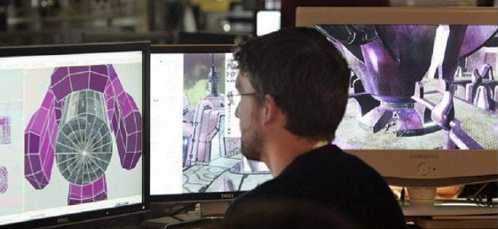
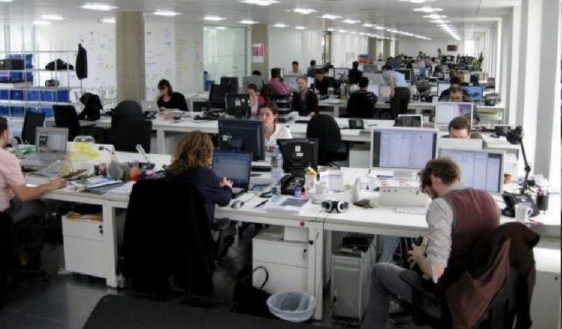
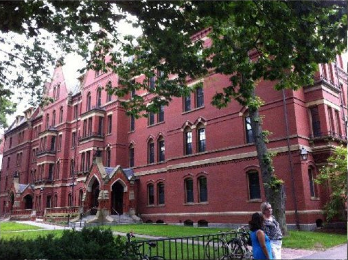

# Karakteristik Pekerjaan di Era Digtital

## Daftar Isi

- [Karakteristik Pekerjaan di Era Digtital](#karakteristik-pekerjaan-di-era-digtital)
  - [Daftar Isi](#daftar-isi)
  - [SUMBER DAYA MANUSIA BERBASIS PENGETAHUAN](#sumber-daya-manusia-berbasis-pengetahuan)
    - [Keterampilan yang Diperlukan di Era Digital](#keterampilan-yang-diperlukan-di-era-digital)
      - [Keterampilan komunikasi](#keterampilan-komunikasi)
      - [Kemampuan belajar mandiri](#kemampuan-belajar-mandiri)
      - [Etika dan tanggung jawab](#etika-dan-tanggung-jawab)
      - [Kerja sama tim dan fleksibilitas](#kerja-sama-tim-dan-fleksibilitas)
      - [Keterampilan berpikir](#keterampilan-berpikir)
      - [Keterampilan digital](#keterampilan-digital)
      - [Manajemen pengetahuan](#manajemen-pengetahuan)
    - [Haruskah Pendidikan Dikaitkan Langsung ke Pasar Tenaga Kerja](#haruskah-pendidikan-dikaitkan-langsung-ke-pasar-tenaga-kerja)
    - [Perubahan dan Kesinambungannya](#perubahan-dan-kesinambungannya)
  - [Rangkuman](#rangkuman)

Dari sekian banyak tantangan yang dihadapi lembaga pendidikan, yang secara esensial merupakan kabar baik adalah meningkatnya jumlah permintaan lulusan pendidikan tinggi di dunia kerja. Karakteristik pekerjaan di era digital berbeda dengan era sebelumnya. Gambar 1.1 di bawah ini menunjukkan bahwa pengetahuan (knowledge) telah menjadi elemen yang semakin penting dalam pembangunan ekonomi. Tampak dalam gambar ini signifikansi pengetahuan  dalam penciptaan lapangan kerja di semua sektor.

[Gambar 1.1](../media/Gambar-1.1.png "Komponen Pekerjaan Berbasis Pengetahuan sebagai Karakteristik Pekerjaan di Era Digital [Gambar diadaptasi dari Bates (2016)]")

Ilustrasi dalam Gambar 1.1. lebih bersifat simbolik daripada literal. Lingkaran-lingkaran putih yang mewakili seluruh angkatan kerja di setiap sektor ketenagakerjaan mungkin lebih besar atau lebih ecil tergantung di negara mana dan proporsi pekerja di sektor pekerjaan tersebut. Namun, di negara maju dan negara berkembang yang ekonominya tumbuh, paling tidak kebutuhan akan komponen pekerjaan berbasis pengetahuan itu berkembang pesat. Artinya, kerja otak lebih dibutuhkan daripada kerja otot ([Lihat OECD, 2013a](http://skills.oecd.org/OECD_Skills_Outlook_2013.pdf)).

Secara ekonomi, keunggulan kompetitif akan semakin meningkat dan keunggulan tersebut hanya akan dimiliki oleh perusahaan dan industri yang dapat memanfaatkan pengetahuan dengan baik ([OECD, 2013b](http://www.oecd.org/daf/competition/Knowledge-based-capital-%20KeyFindings2013.pdf)). Dalam kenyataannya, SDM-berbasis-pengetahuan atau pekerja-pengetahuan (knowledge workers) memang sering mampu menciptakan pekerjaan sendiri. Mereka bahkan mampu untuk memulai mendirikan perusahaan yang  menyediakan layanan atau produk baru sebelum mereka lulus dari pendidikan tinggi.

Dari perspektif pendidikan,  dampak terbesar kebutuhan pekerja-pengetahuan ini akan dirasakan oleh pengajar dan pembelajar terutama di sekolah-sekolah kejuruan. Hal ini wajar karena dalam sejarahnya, pengetahuan dan keterampilan  pekerjaan-pekerjaan yang bersifat manual yang berkembang pesat di jamannya. Pengetahuan tersebut sudah terakumulasi, terutama di bidang perdagangan dan pekerjaan teknis seperti mekanik mobil, perlistrikan, dan lain sebagainya. Demikian pula sektor yang berhubungan dengan perdagangan yang memerlukan  solusi spesialis teknologi informasi.  Akumulasi pengetahuan tersebut semakin meningkat seiring dengan tumbuhnya para wiraswastawan/wati yang  membutuhkan jenis-jenis  keterampilan yang terkait dengan profesi mereka.

Dampak lain dari pertumbuhan pekerjaan-berbasis-pengetahuan (knowledge-based work) adalah kebutuhan akan SDM dengan tingkat pendidikan yang lebih tinggi daripada sebelumnya. Permintaan akan lulusan yang berkualitas dari perguruan tinggi semakin meningkat. Sementara itu, di universitas sendiri, jenis pengetahuan dan keterampilan yang dibutuhkan mahasiswa juga berubah.

## SUMBER DAYA MANUSIA BERBASIS PENGETAHUAN

Ada beberapa fenomena umum dari pekerja-pengetahuan yang dibutuhkan di era digital ini yang perlu dicermati. Beberapa di antaranya adalah sebagai berikut.

1. mereka biasanya bekerja di perusahaan kecil (kurang dari 10 orang).
2. mereka memiliki bisnis mereka sendiri atau mereka sebagai bosnya.
3. mereka menciptakan pekerjaan mereka sendiri; menciptakan suatu pekerjaan yang belum pernah ada namun kemudian justru jenis pekerjaan baru itulah yang dibutuhkan.
4. mereka sering bekerja dengan kontrak sebagai wiraswasta, sehingga mereka sering bergerak dari satu pekerjaan ke pekerjaan yang lain.
5. sifat pekerjaan mereka cenderung berubah seiring dengan berjalannya waktu. Hal ini terjadi ketika mereka merespons perkembangan pasar dan teknologi sehingga basis pengetahuan yang dibutuhkan untuk pekerjaan mereka cenderung berubah dengan cepat.
6. mereka secara digital cerdas atau setidaknya kompeten secara digital; teknologi digital seringkali merupakan komponen kunci dari pekerjaan mereka.
7. karena mereka sering bekerja untuk diri sendiri atau di perusahaan kecil, mereka memainkan banyak peran: pemasar, perancang, salesperson, akuntan/manajer bisnis, dan personel dukungan teknis.
8. mereka sangat bergantung pada jaringan sosial yang bersifat informal untuk dunia bisnisnya dan selalu mengikuti tren yang sedang berkembang di bidang pekerjaan mereka.
9. mereka harus belajar untuk tetap berada di puncak dalam pekerjaan dan mereka harus mampu mengelola pembelajaran untuk diri sendiri.
10. di atas segalanya, mereka harus fleksibel dan mampu beradaptasi dengan cepat termasuk mengubah kondisi yang ada di sekitar mereka.

Dengan adanya fenomena tersebut sehingga tampaklah bahwa ternyata memang tidak mudah untuk memprediksi dengan akurat apakah yang akan dilakukan oleh para lulusan pendidikan tinggi sepuluh tahun kemudian; kecuali dalam arti yang umum dan sangat luas. Hal ini bahkan akan terjadi juga di bidang yang mempunyai trek profesional yang jelas seperti kedokteran, keperawatan, atau teknik. Basis pengetahuan dan tuntutan di dunia kerja mereka cenderung mengalami perubahan atau transformasi yang sangat cepat dari waktu ke waktu. Namun, di sisi lain kita dapat melihat bahwa adalah sangat mungkin untuk memprediksi betapa banyak keterampilan yang mereka butuhkan untuk bertahan hidup atau hidup makmur dalam lingkungan kerja yang seperti itu.

Secara keseluruhan, fenomena seperti ini  adalah kabar baik bagi pendidikan tinggi. Sebagai dampak kebutuhan di dunia kerja, ada tuntutan  terhadap level pengetahuan dan keterampilan yang semakin meningkat. Hal ini akan memicu perguruan tinggi untuk memperluas bidang yang ditawarkan sehingga dapat menghasilkan lebih banyak lulusan yang dibutuhkan oleh dunia kerja, Dengan kata lain, memasok kebutuhan SDM yang mampu menangani  jenis-jenis pekerjaan-berbasis-pengetahuan di tingkat yang lebih tinggi.

Sebagai ilustrasi, pemerintah daerah Ontario di Kanada sudah memiliki angka tingkat  partisipasi hampir 60% untuk lulusan sekolah menengah yang masuk jenjang diploma atau pendidikan tinggi. Angka tersebut akan ditingkatkan menjadi 70% untuk mengimbangi hilangnya pekerjaan di sektor manufaktur tradisional. Artinya, perguruan tinggi yang ada akan menampung lebih banyak mahasiswa ([Ontario, 2012](http://www.tcu.gov.on.ca/pepg/publications/DiscussionStrengtheningOntarioPSE.pdf)).

### Keterampilan yang Diperlukan di Era Digital

Pengertian ‘pengetahuan’ mengandung arti adanya dua elemen yang berbeda namun sangat berkaitan, yaitu: konten dan keterampilan. Konten mencakup fakta, ide, prinsip, bukti, dan deskripsi proses atau prosedur.  Pengajar pada umumnya, setidaknya di universitas, sangat terlatih dan ahli dalam hal konten dan mereka memiliki pemahaman yang mendalam dalam bidang keilmuan yang diajarkan. Namun, kepakaran/keahilan dalam pengembangan keterampilan (skills) adalah hal lain. Masalahnya bukan karena tidak cukup banyak pengajar yang dapat membantu mahasiswa untuk mengembangkan berbagai keterampilan. Para pengajar sebenarnya sudah membantu. Tetapi, pertanyaannya adalah apakah keterampilan-keterampilan intelektual yang mereka ajarkan itu masih relevan dengan kebutuhan tenaga kerja berbasis pengetahuan yang dibutuhkan saat ini? Apakah pengembangan keterampilan tersebut sudah dimasukkan ke dalam kurikulum yang selama ini digunakan?

Mengacu pada Conference Board Canada (2014) beberapa keterampilan yang diperlukan dalam masyarakat-pengetahuan (knowledge society)  di era digital, kurang lebih adalah sebagai berikut.

#### Keterampilan komunikasi

Meskipun di masyarakat sudah ada keterampilan komunikasi tradisional dalam berbagai bentuk seperti membaca, berbicara dan menulis secara koheren dan jelas; kita perlu menambahkan satu lagi yaitu: keterampilan komunikasi media sosial. Dalam hal ini juga termasuk kemampuan untuk membuat video singkat YouTube dan kemampuan untuk menjangkau audiensi atau komunitas yang lebih luas melalui Internet dengan gagasan-gagasan, kemampuan untuk menerima dan memberikan umpan balik, kemampuan untuk berbagi informasi dengan tepat, dan kemampuan untuk mengidentifikasi tren dan ide-ide dari tempat lain.

#### Kemampuan belajar mandiri

Dalam konteks ini, pengertian belajar mandiri adalah kemampuan untuk mengambil tanggung jawab dalam bekerja di luar apa yang perlu Anda ketahui dan kemampuan menemukan pengetahuan itu. Ini adalah sebuah proses yang terjadi dalam pekerjaan berbasis pengetahuan karena basis pengetahuannya terus berubah.  Dalam hal ini kita tidak membahas pengetahuan akademis meskipun pengetahuan itu juga berubah. Ini adalah tentang belajar, misalnya, peralatan baru, cara-cara baru dalam melakukan sesuatu, atau belajar menemukan siapa orang tepat yang perlu Anda hubungi untuk dapat menyelesaikan pekerjaan.

#### Etika dan tanggung jawab

Keterampilan ini diperlukan untuk membangun kepercayaan (terutama dalam jaringan sosial informal). Di sisi lain, yang juga cukup penting, adalah karena dalam dunia bisnis banyak pelaku yang berbeda dan adanya tingkat ketergantungan yang lebih besar pada orang lain untuk mencapai tujuan.

#### Kerja sama tim dan fleksibilitas

Meskipun banyak para pekerja pengetahuan yang bekerja secara independen atau di perusahaan yang sangat kecil, mereka sangat tergantung pada kolaborasi dan berbagi pengetahuan dengan orang lain dalam organisasi yang terkait. Di perusahaan kecil, sangat penting bahwa semua karyawan bekerja sama, berbagi visi yang sama untuk sebuah perusahaan dan saling membantu. Secara khusus, pekerja pengetahuan perlu tahu bagaimana bekerja secara kolaboratif dengan kolega, klien dan mitra/rekanan.  'Penggabungan' pengetahuan kolektif, solusi masalah, dan tahapan implementasi membutuhkan kerja tim yang baik dan fleksibilitas. Kerja sama ini diperlukan baik dalam penyelesaian tugas maupun pemecahan masalah yang masalahnya sendiri mungkin baru atau di luar karakteristik pekerjaan yang selama ini ditangani.

#### Keterampilan berpikir

Dimensi keterampilan berpikir kritis ini meliputi aspek-aspek berpikir kritis, pemecahan masalah, kreativitas, orisinalitas, dan strategi. Dari semua keterampilan, keterampilan ini termasuk yang paling dibutuhkan dalam masyarakat berbasis pengetahuan. Dunia bisnis semakin tergantung pada penciptaan produk baru, layanan baru, dan proses baru untuk menekan biaya dan meningkatkan daya saing. Universitas biasanya  diasumsikan selalu membanggakan diri pada pengajaran keterampilan intelektual tersebut. Namun, sekarang universitas perlu pindah ke “kelas yang lebih besar” dan lebih mengarah pada upaya mentransmisi informasi yang lebih berkualitas, terutama di jenjang pendidikan di tingkat sarjana. Hal ini juga sekaligus untuk menguji asumsi tentang kebanggaan tersebut. Perlu dicatat, bahwa tidak hanya manajemen tingkat atas yang memerlukan keterampilan berpikir ini. Orang-orang yang berkecimpung di dunia perdagangan semakin menjadi orang yang mampu memecahkan masalah daripada sekadar mengikuti proses-proses standar yang cenderung semakin diotomatiskan. Siapa pun yang berurusan dengan kebutuhan masyarakat diharapkan dapat mengidentifikasi masalah dan menemukan solusi yang tepat.

#### Keterampilan digital

Sebagian besar aktivitas berbasis pengetahuan sangat tergantung pada penggunaan teknologi. Namun masalah kuncinya adalah bahwa keterampilan tersebut perlu berada dalam domain pengetahuan dimana kegiatan berlangsung. Sebagai ilustrasi, misalnya, agen real estat mengetahui bagaimana menggunakan sistem informasi geografis untuk mengidentifikasi tren penjualan dan harga di lokasi geografis yang berbeda, tukang las mampu mengetahui bagaimana menggunakan komputer untuk mengontrol robot yang memeriksa dan memperbaiki pipa, ahli radiologi mampu mengetahui bagaimana menggunakan teknologi baru yang digunakan untuk membaca dan menganalisa scan MRI. Dengan demikian penggunaan teknologi digital perlu diintegrasikan dan dievaluasi melalui pengetahuan-dasar dari berbagai bidang pekerjaan dan keilmuan.

#### Manajemen pengetahuan

Keterampilan manajemen pengetahuan ini mungkin yang paling menjadi payung bagi semua keterampilan. Pengetahuan tidak hanya berubah dengan cepat dengan penelitian baru, perkembangan baru, dan penyebaran ide dan praktik yang cepat melalui Internet;  tetapi juga diakibatkan oleh sumber informasi yang meningkat. Keberlimpahan sumber informasi dengan segala variabilitasnya dalam hal keandalan dan validitas informasi itu sendiri merupakan fenomena tersendiri. Artinya, pengetahuan seorang insinyur yang belajar di universitas dapat dengan cepat menjadi usang. Ada begitu banyak informasi sekarang di bidang kesehatan yang tidak mungkin bagi mahasiswa kedokteran untuk menguasai semua obat perawatan, prosedur medis,  dan ilmu pengetahuan baru seperti rekayasa genetika yang  bahkan muncul dalam delapan tahun terakhir.  Keterampilan utama dalam masyarakat berbasis pengetahuan adalah keterampilan manajemen pengetahuan dalam bentuk bagaimana menemukan, mengevaluasi, menganalisa, menerapkan, dan menyebarluaskan informasi dalam konteks yang tepat. Manajemen pengetahuan adalah keterampilan yang diperlukan mahasiswa karena akan tetap mereka butuhkan meskipun jauh setelah mereka lulus dari perguruan tinggi.  Kita dapat mengetahui  banyak mengenai hal ini jauh hari dari penelitian tentang keterampilan dan pengembangan keterampilan. Lihat, misalnya [Fischerac (1980)](http://www.gse.harvard.edu/~ddl/articlesCopy/FischerTheoryCognDev1980.pdf) serta [Fallow dan Steven (2000)](http://books.google.ca/books?hl=en&lr=&id=ldBTAQAAQBAJ&oi=fnd&pg=PP1&dq=Books+2012:+skills+development+&ots=ynzUemTGgy&sig=BbIrHGgmA3GJ0rzn9PJw7AonV3E#v=onepage&q&f=false) yang mengungkapkan sebagai berikut.

1. Pengembangan keterampilan relatif dalam konteks spesifik. Dengan kata lain, keterampilan ini perlu diintegrasikan dalam domain pengetahuan. Sebagai contoh, pemecahan masalah dalam kedokteran berbeda dari pemecahan masalah dalam bisnis.  Proses dan pendekatan yang berbeda digunakan untuk memecahkan masalah dalam domain ini (misalnya, obat cenderung lebih deduktif, bisnis lebih intuitif; obat lebih ke arah menghindari risiko, bisnis lebih dapat menerima solusi yang berisiko tinggi risiko atau mengandung elemen ketidakpastian).
2. Mahasiswa memerlukan latihan. Manfaat latihan adalah untuk mencapai penguasaan dan konsistensi keterampilan tertentu.
3. Keterampilan pada umumya dapat dipelajari dengan sangat baik dengan langkah-langkah yang relatif kecil.  Tingkat penguasaan akan meningkat seiring dengan peningkatan langkah-langkah atau tahapan tersebut.
4. Mahasiswa membutuhkan umpan balik secara teratur untuk mempelajari keterampilan dengan cepat dan efektif. Umpan balik langsung biasanya lebih baik daripada umpan balik yang tertunda atau terlambat.
5. Meskipun keterampilan dapat dipelajari dengan trial and error  dan tanpa campur tangan seorang dosen, pelatih, atau teknologi, pengembangan keterampilan dapat ditingkatkan dengan drastis melalui intervensi yang tepat. Artinya, peningkatan tersebut dapat dilakukan dengan menggunakan metode pengajaran dan teknologi yang tepat untuk pengembangan keterampilan.
6. Meskipun konten yang sama dapat ditransmisikan secara efektif melalui berbagai media, pengembangan keterampilan jauh lebih ditentukan oleh pendekatan dan teknologi pembelajaran yang digunakan.

Implikasi di pendidikan tinggi dalam bentuk pengajaran di seputar konten dan keterampilan sebenarnya tergantung dari seberapa jauh perhatian yang diberikan oleh perguruan tinggi dalam kurikulumnya untuk  mengembangkan keterampilan-keterampilan tersebut.

### Haruskah Pendidikan Dikaitkan Langsung ke Pasar Tenaga Kerja

Mengenai hubungan antara pendidikan dan lapangan kerja, adalah bahaya jika perguruan tinggi dan program sekolah dikaitkan langsung dengan kebutuhan pasar tenaga kerja yang mendadak. Permintaan pasar tenaga kerja dapat bergeser dengan sangat cepat. Khusus dalam masyarakat berbasis pengetahuan, adalah mustahil untuk menilai jenis pekerjaan apa, bisnis, atau perdagangan apa yang akan muncul di masa depan. Misalnya, siapa yang akan meramalkan 20 tahun yang lalu bahwa salah satu perusahaan terbesar di dunia dalam hal valuasi pasar saham akan muncul dari pengembangan teknologi untuk mencari cara pemeringkatan gadis terpanas/terpopuler di kampus (sejarah bagaimana Facebook muncul).

Fokus pada berbagai keterampilan yang dibutuhkan dalam era digital menimbulkan pertanyaan tentang tujuan pendidikan tinggi pada khususnya dan dunia pendidikan pada umumnya. Apakah tujuan pendidikan tinggi adalah  untuk menyediakan karyawan terampil yang siap untuk masuk pasar tenaga kerja? Ekspansi yang cepat dalam pendidikan tinggi sebagian besar memang didorong oleh pemerintah, pemilik perusahaan, dan orang tua yang menginginkan para lulusan dapat dipekerjakan dan kompetitif.

Dalam kenyataannya, pertama, tugas mempersiapkan pekerja profesional memang selalu diemban oleh perguruan tinggi dan hal ini sebenarnya mengacu pada tradisi panjang pelatihan di masa lampau di institusi gereja, hukum, administrasi pemerintah. Kedua, pembelajaran yang berfokus pada keterampilan yang diperlukan untuk sebuah masyarakat berbasis pengetahuan (sering disebut sebagai keterampilan abad ke-21). ternyata pada praktiknya ada yang hanya memperkuat jenis pembelajaran di aspek pengembangan keterampilan intelektual saja yang sebenarnya menjadi kebanggaan univeristas di masa lalu.

Dalam dunia bursa kerja, melayani kebutuhan belajar individual memang lebih kritikal dibanding melayani kebutuhan perusahaan atau sektor pekerjaan yang spesifik.  Saat ini, agar dapat bertahan hidup di pasar tenaga kerja, peserta didik harus fleksibel dan mampu beradaptasi dan bekerja sama baik untuk kepentingan diri mereka sendiri maupun kepentingan perusahaan yang cenderung mempunyai siklus operasional yang semakin singkat. Dengan demikian, tantangannya tidak hanya merumuskan kembali tujuan pendidikan tetapi memastikan tujuan dapat terpenuhi dengan lebih efektif.

### Perubahan dan Kesinambungannya

Di era media sosial dan di era keterhubungan yang konstan, inilah saatnya adanya perubahan dari perguruan tinggi yang monolitik sebagai elite dalam tembok tertutup bergeser ke fase yang jauh terbuka, ringan, dan mengalir - Anya Kamenetz (2010)

Meskipun tulisan ini ditujukan untuk pengajar di sekolah dan perguruan tinggi, kami ingin menyampaikan bagaimana era digital berdampak pada pendidikan tinggi. Ada semacam kepercayaan umum, bahkan dari yang sudah diuntungkan karena lulus dari universitas elite, bahwa universitas ibarat menara gading. Perguruan tinggi sebagai sesuatu yang di luar jangkauan dalam arti kebebasan akademik ternyata dimaknai sebagai kebenaran untuk melindungi gengsi dan karier para profesor sudah duduk di tempat yang nyaman yang tidak memerlukan perubahan. Ada juga pendapat yang mengatakan bahwa lembaga akademis sebaiknya menjadi milik zaman abad pertengahan saja; dengan kata lain, perguruan tinggi adalah artefak masa lalu sehingga perlu diganti dengan sesuatu yang sama sekali baru.

Meskipun demikian, ada juga alasan yang sangat baik mengapa universitas yang sudah ada sejak lebih dari 800 tahun yang lalu tetapi cenderung tetap relevan di masa depan. Dalam sejarahnya, universitas sengaja dirancang untuk melawan tekanan eksternal. Mereka telah melihat, raja dan pemimpin agama (Paus), pemerintah, korporasi datang dan pergi. Semua kekuatan eksternal ini secara fundamental tidak mengubah sifat universitas sebagai sebuah lembaga. Universitas bangga pada independensi, kebebasan, dan kontribusi mereka kepada masyarakat. Dengan demikian, secara sekilas dapat kita lihat saat ini bahwa pada hakikatnya jika ada perubahan apa pun yang mengancam nilai-nilai inti atau esensial suatu perguruan tinggi, maka penolakan yang paling kuat cenderung datang dari para profesor dan para pengajar yang ada di universitas.

Universitas pada dasarnya berkiprah dalam penciptaan, pemeliharaan, dan diseminasi, dan evaluasi ilmu pengetahuan. Dalam masyarakat peran ini bahkan lebih penting di saat ini dibandingkan di masa lalu. Bagi universitas, mereka perlu berperan dengan lebih baik meskipun beberapa persyaratan atau kondisi tertentu  harus dipenuhi.

Pertama universitas membutuhkan otonomi yang lebih besar. Nilai potensi pengetahuan baru secara khusus sulit diprediksi sehingga universitas perlu cara yang aman dalam percaturan dalam ketidakpastian di masa depan. Hal ini dapat dilakukan dengan mendorong penelitian dan pengembangan yang inovatif yang mungkin tidak secara langsung memberikan manfaat yang jelas dalam jangka pendek. Seperti kurang terarah tetapi tidak menimbulkan kerugian ekonomi atau sosial yang besar. Peran penting lainnya adalah kemampuan universitas untuk mempertanyakan ulang asumsi atau posisi kuat lembaga-lembaga di luar universitas (misalnya, pemerintah atau industri). Pertanyaan itu penting terutama rintisan inovasinya tampak bertentangan dengan prinsip atau nilai-nilai etika dan kebaikan yang ada di masyarakat umum.

Bahkan yang lebih penting lagi, mungkin, adalah adanya beberapa prinsip yang membedakan pengetahuan akademis dari pengetahuan sehari-hari seperti  logika dan penalaran, kemampuan untuk bergeser dari hal-hal yang bersifat abstrak ke hal-hal yang konkret termasuk  konsep-konsep yang didukung oleh bukti empiris dan validasi eksternal (Lihat misalnya, [Laurillard 2001](http://www.amazon.co.uk/Rethinking-University-Teaching-Routledge-2001/dp/B00DHO14WY/ref=sr_1_fkmr0_2?s=books&ie=UTF8&qid=1402428736&sr=1-2-fkmr0&keywords=Laurillard%2C+D.+%282001%29+Rethinking+University+Teaching%3A+A+Conversational+Framework+for+the+Effective+Use+of+Learning+Technologies)). Kita berharap universitas dapat bermain di tingkat pemikiran yang lebih tinggi, bukan pada hal-hal yang biasa kita lakukan sehari-hari baik di level individu maupun korporasi.

Salah satu nilai inti (core values) yang sudah terbukti membantu untuk universitas mempertahankan marwahnya adalah kebebasan akademik. Para akademisi kadang ada yang mengajukan pertanyaan-pertanyaan aneh, yang menentang status quo, atau menunjukkan bukti-bukti bertentangan dengan versi pemerintah atau perusahaan. Mereka harus tetap dilindungi haknya untuk mengekspresikan pandangan-pandangan tersebut. Kebebasan akademik adalah elemen yang esensial  dalam masyarakat. Di sisi lain, hal ini juga berarti bahwa para akademisi bebas untuk memilih apa yang mereka ingin pelajari. Yang lebih penting lagi, seperti yang dibahas di Modul ini, adalah bagaimana menemukan cara terbaik untuk mengkomunikasikan pengetahuan yang mereka miliki. Pembelajaran di pendidikan tinggi memang tidak dapat lepas dari kebebasan akademik dan otonomi. Namun, meskipun otonominya dilindungi, sebagai suatu perguruan tinggi, tetap saja adanya tekanan yang semakin meningkat.

Kami sengaja menekankan hal tekanan dan perubahan ini untuk satu dan satu alasan saja. Jika universitas mengubah diri untuk memenuhi tekanan eksternal agar berubah, perubahan ini harus datang dari dalam organisasi, dan khususnya dari para profesor dan para pengajar sendiri. Fakultas harus melihat perlunya perubahan dan bertekad membuat perubahan itu. Jika pemerintah atau masyarakat mencoba untuk mengintroduksikan perubahan dari luar dengan membawa nilai-nilai yang bertentangan dengan  nilai-nilai inti universitas seperti kebebasan akademik, maka ada risiko bahwa universitas dengan tradisinya  yang unik dan berharga bagi masyarakat akan dihancurkan sehingga membuat keberadaan universitas menjadi kurang bernilai bagi masyarakat secara keseluruhan. Namun, Modul  ini juga akan memberikan beberapa alasan mengapa yang perlu melakukan perubahan tidak hanya mahasiswa tetapi juga para pengajar terutama dalam hal mengelola beban kerja dan memanfaatkan berbagai sumber untuk mendukung pembelajaran.

Pendidikan di jenjang diploma dalam posisi yang agak berbeda dengan di jenjang sarjana.  Perubahan akan lebih mudah (meskipun sebenarnya tidak terlalu mudah juga) bila datang dari atas atau melalui tekanan dari luar seperti dari pemerintahan. Namun, dalam  literatur perubahan manajemen menunjukkan bahwa perubahan yang terjadi akan lebih konsisten dan lebih dalam jika terdapat pemahaman yang baik terhadap kebutuhan untuk berubah dan memiliki keinginan  yang kuat untuk berubah (Lihat, misalnya, [Weiner, 2009](http://www.implementationscience.com/content/4/1/67)). Dengan demikian, dalam banyak hal, lembaga pendidikan di tingkat diploma maupun universitas sebenarnya menghadapi tantangan yang sama; yaitu, bagaimana berubah namun tetap melestarikan integritas dan tujuan lembaga itu didirikan.

## Rangkuman

Perkembangan teknologi, terutama teknologi digital, memberikan dampak yang nyata di sektor eknomi dan industri yang kemudian merembet ke sektor-sektor lain yang diantaranya adalah sektor pendidikan. Munculnya jenis-jenis pekerjaan baru yang terkait dengan teknologi digital membutuhkan SDM atau tenaga kerja yang berbasis pengetahuan atau yang dikenal dengan ”pekerja pengetahuan” atau knowledge worker.  Beberapa fenomena di seputar pekerja pengetahuan ini antara lain adalah mereka biasnya bekerja di perusahan kecil, memilik bisnis sendiri, menciptakan pekerjaan sendiri, kontrak sebagai wiraswasta, sifat pekerjaannya cenderung berubah, memainkan banyak peran, bergantung pada jaringan sosial, dan dalam konteks dunia kerja digital mereka dikenal sebagai personel yang cerdas dan kompeten. Mengenai keterampilan yang diperlukan dalam masyarakat pengetahuan (knowledge society) antara lain adalah keterampilan  komunikasi, beretika dan bertanggung jawab, keterampilan kerjasama tim, keterampilan berpikir, keteramapilan berbasis manajemen-pengetahuan, dan keterampilan digital.
