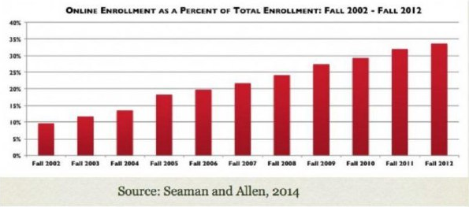

# Pendidikan Tinggi di Era Digital

## Daftar Isi

- [Pendidikan Tinggi di Era Digital](#pendidikan-tinggi-di-era-digital)
  - [Daftar Isi](#daftar-isi)
  - [KELAS BESAR](#kelas-besar)
  - [KERAGAMAN SISWA YANG LEBIH BESAR](#keragaman-siswa-yang-lebih-besar)
  - [BURSA PEMBELAJARAN SEPANJANG HAYAT](#bursa-pembelajaran-sepanjang-hayat)
    - [Pribumi Digital [Digital Natives]](#pribumi-digital-digital-natives)
      - [Dari Elitisme hingga Sukses](#dari-elitisme-hingga-sukses)
      - [Dari Tepi ke Inti: Bagaimana Teknologi Mengubah Dunia Pembelajaran](#dari-tepi-ke-inti-bagaimana-teknologi-mengubah-dunia-pembelajaran)
    - [Pembelajaran Online Penuh (Fully Online)](#pembelajaran-online-penuh-fully-online)
    - [Pembelajaran Hibrida](#pembelajaran-hibrida)
    - [Pembelajaran Terbuka](#pembelajaran-terbuka)
  - [MOOCS](#moocs)
  - [RANGKUMAN](#rangkuman)

Pemerintah di tingkat pusat dan daerah merespons kebutuhan akan tenaga kerja berpendidikan tinggi dengan cara yang berbeda-beda. Di beberapa negara, misalnya Kanada, telah meningkatkan anggaran pendidikan tinggi seiring dengan peningkatan jumlah mahasiswa. Negara lain seperti Amerika Serikat, Australia dan Inggris dan Wales melakukannya dengan pemotongan yang besar terhadap anggaran operasional dan dikombinasikan dengan peningkatan biaya kuliah besar-besaran.

Gambar 1.6
Jumlah Siswa Lebih Banyak Berdampak Ukuran Kelas yang Lebih Besar

## KELAS BESAR

Keluhan umum dari universitas pada umumnya adalah pemerintah tidak meningkatkan pendanaan yang sebanding dengan peningkatan jumlah siswa. Bahkan, situasinya jauh lebih rumit dari itu; sebagian besar universitas yang menampung mahasiswa dalam jumlah besar menggunakan strategi sebagai berikut.

1. mempekerjakan lebih banyak tenaga dosen luar/kontrak dengan gaji lebih rendah daripada dosen yang ada di fakultas.
2. meningkatkan penggunaan mahasiswa sebagai asisten dosen.
3. meningkatkan ukuran kelas.
4. meningkatkan beban kerja fakultas.

Semua strategi dampak kelas besar di atas cenderung berdampak negatif pada kualitas jika metode tidak ada perubahan pembelajarannya. Berikut ini adalah uraian yang lebih rinci mengenai strategi alternatif sebagai dampak munculnya kelas besar.

*Mengontrak pengajar* untuk dikaryakan sebagai dosen penuh waktu memang lebih murah tetapi mereka biasanya tidak memiliki peran yang sama seperti dosen biasa; misalnya, dalam hal pemilihan kurikulum dan bahan bacaan. Meskipun kualitas akademik mereka sangat baik, sifat pekerjaan sebagai dosen kontrak itu sendiri membuat pengalaman dan pengetahuan mereka tentang mahasiswa akan menghilang begitu saja begitu kontrak berakhir. Strategi tersebut sepertinya memiliki dampak negatif yang paling sedikit terhadap kualitas. Namun, sayangnya merupakan harga yang harus dibayar mahal oleh universitas.

Asisten Dosen mungkin tidak lama lagi akan lulus dan hanya selisih beberapa tahun dari mahasiswanya. Mereka pada umumnya kurang terlatih dalam mengajar atau mendapatkan supervisi. Jika kebetulan mahasiswanya adalah mahasiswa asing (seperti yang sering terjadi) maka pembelajaran kurang efektif atau sulit dimengerti karena adanya kendala bahasa. Para asisten dosen ini sering diminta untuk mengajar mata kuliah yang sama secara paralel. Dengan demikian, tergantung dosennya; tingkat pembelajaran mahasiswa akan sangat bervariasi. Pada umumnya para asisten dosen adalah mahasiswa pasca sarjana sehingga materi yang mereka ajarkan dapat dikaitkan langsung dengan topik penelitian mereka yang didanai pemerintah.

Ukuran kelas yang semakin besar cenderung membuat lebih banyak waktu yang digunakan untuk kuliah daripada untuk aktivitas pembelajaran seperti diskusi-diskusi dalam kelompok kecil. Pembelajaran dalam bentuk kuliah sebenarnya merupakan cara yang sangat ekonomis untuk kelas-kelas besar (asalkan ruang kuliah cukup besar untuk menampung mahasiswa tambahan). Biaya marginal untuk mahasiswa tambahan yang mengikuti kuliah relatif kecil. Namun, karena jumlah mahasiswa sangat banyak, dalam memberikan penilaian hasil belajar para pengajar cenderung menggunakan pendekatan kuantitatif dan kurang fleksibel. Misalnya, menggunakan tes pilihan ganda dan penilaian otomatis yang dilakukan oleh mesin.

Hal lebih penting, mungkin, adalah interaksi mahasiswa dengan dosen menurun drastis seiring dengan ukuran kelas yang semakin besar. Pola interaksi yang terjadi cenderung berupa interaksi antara dosen dengan mahasiswa secara individu daripada antara sesama mahasiswa dalam kelompoknya. Penelitian ([Bligh, 2000](http://books.google.ca/books/about/What_s_the_use_of_lectures.html?id=nXEmAQAAIAAJ&redir_esc=y)) menunjukkan bahwa kuliah dengan 100 atau lebih siswa, ternyata membuat kelas kurang aktif. Siswa yang mengajukan pertanyaan atau memberikan komentar selama satu semester ternyata kurang dari sepuluh. Kesimpulannya adalah, kuliah di kelas besar cenderung lebih fokus pada transmisi pengetahuan, bukan bersifat penajaman pemahaman dalam bentuk eksplorasi, klarifikasi, dan diskusi.

Meningkatkan beban pengajaran dosen (lebih banyak mata kuliah yang akan diajarkan) adalah strategi yang paling umum digunakan karena adanya resistensi adanya fakultas yang terkadang muncul. Dengan adanya peningkatan beban kerja dosen, sekali lagi, kualitas pembelajaran cenderung menurun. Hal ini terjadi karena dosen tidak mempunyai cukup waktu untuk melakukan persiapan sehingga mereka terpaksa mengandalkan cara-cara yang cepat dan mudah terutama dalam menilai hasil belajar mahasiswanya. Bagi dosen internal universitas yang penuh waktu, sisi lain yang tidak dapat dihindari adalah lebih sedikit waktu untuk mengajar karena sebagian besar waktunya sudah dialokasikan untuk penelitian.

Di beberapa sektor ketenagakerjaan non-pendidikan, permintaan SDM yang meningkat tidak selalu menyebabkan meningkatnya biaya jika tenaga kerja di sektor tersebut lebih produktif. Sebenarnya pemerintah juga berusaha mencari solusi untuk membuat lembaga pendidikan tinggi lebih produktif. Bagaimana universitas lebih banyak menghasilkan mahasiswa yang lebih berkualitas dengan pengeluaran/ biaya yang sama atau lebih kecil. ([Lihat Ontario, 2012](http://www.tcu.gov.on.ca/pepg/publications/DiscussionStrengtheningOntarioPSE.pdf)). Hingga saat ini, tekanan tuntutan kuantitas dan kualitas ini sudah berusaha dipenuhi oleh universitas dalam periode waktu yang cukup lama dan berjalan secara bertahap baik dalam bentuk meningkatkan ukuran kelas maupun menggunakan tenaga kerja (misal, asisten dosen) yang lebih murah. Namun disinilah titik lemahnya. Kualitas akan dikorbankan apabila tidak ada perubahan yang mendasar dalam proses pembelajaran mahasiswa dan yang kami maksudkan adalah bagaimana pembelajaran itu dirancang dan diimplementasikan.

Jika tanpa diiringi perubahan metode pembelajaran, maka efek samping peningkatan jumlah kelas besar adalah para dosen harus bekerja lebih keras. Intinya, mereka menangani lebih banyak mahasiswa. Jika para dosen mengubah cara untuk melakukan sesuatu (mengajar), maka akan menghasilkan lebih produktif. Namun, fakultas biasanya bereaksi negatif terhadap konsep produktivitas karena tidak ingin melihat proses pendidikan sebagai industrialisasi. Sebaiknya sebelum menolak konsep perubahan, fakultas perlu mempertimbangkan gagasan atau solusi baru untuk mendapatkan hasil yang lebih baik bukan dengan bekerja keras tetapi bekerja dengan lebih cerdas. Bisakah kita mengubah pembelajaran membuatnya lebih produktif sehingga baik mahasiswa maupun dosen dapat memperoleh manfaatnya di era digital ini?

## KERAGAMAN SISWA YANG LEBIH BESAR

Selama 50 tahun terakhir, mungkin tidak ada perubahan yang signifikan di universitas jika dibandingkan dengan perubahan yang ada di sisi mahasiswa sendiri. Di 'masa-masa lalu yang indah', fakta menunjukkan tidak sampai sepertiga dari siswa sekolah menengah yang melanjutkan ke pendidikan tinggi dan itu pun sebagian besar dari mereka berasal dari keluarga lulusan perguruan tinggi. Mereka biasanya berasal dari keluarga kaya atau setidaknya berlatar belakang finansial yang cukup. Perguruan tinggi di masa itu sangat selektif dan hanya menerima mereka yang mempunyai rekam jejak akademik terbaik sehingga peluang mereka untuk berhasil sangat tinggi.

Di masa itu, ukuran kelas relatif kecil dan dosen memiliki lebih banyak waktu untuk mengajar dan melakukan penelitian. Keahlian dalam mengajar, memang penting saat itu. Mahasiswa berada di kampus yang sangat kondusif dengan peluang sukses yang tinggi meskipun mereka tidak mendapatkan dosen terbaik kelas dunia. Model ‘tradisional’ ini masih diterapkan di perguruan tinggi yang paling elite seperti Harvard, MIT, Stanford, Oxford, dan Cambridge, dan sebagian kecil akademi liberal arts. Namun, di negara paling maju pun, sebagian besar perguruan tinggi negeri dan akademi sudah tidak lagi bertahan dengan model pendidikan tradisional tersebut.

Kita juga akan melihat bahwa di banyak negara maju, mahasiswa di perguruan tinggi tidak lagi seperti dulu yang menjadi mahasiswa penuh waktu dan mendedikasikan dirinya untuk belajar dan bermain atau sebaliknya. Meningkatnya biaya-biaya kuliah dan biaya hidup memaksa mereka untuk mengambil pekerjaan paruh waktu atau kuliah sambil bekerja. Konflik waktu atau jadwal pun jarang dapat dihindari bahkan bagi mereka yang secara resmi dikategorikan sebagai mahasiswa penuh waktu. Dampaknya adalah: mahasiswa membutuhkan waktu lebih lama untuk lulus. Di Amerika Serikat, waktu penyelesaian sarjana yang sebelumnya empat tahun, sekarang menjadi tujuh tahun ([Lumina Foundation, 2014](http://www.luminafoundation.org/publications/A_stronger_nation_through_higher_education-2014.pdf)).

## BURSA PEMBELAJARAN SEPANJANG HAYAT

Keberadaan kelas-kelas besar dapat dilihat sebagai suatu solusi untuk mahasiswa yang menginginkan lulus dari perguruan tinggi dalam waktu yang tidak terlalu lama karena semakin lama di dunia perkuliahan identik dengan semakin besar biaya yang dikeluarkan. Teknologi dapat mengakselarasi kemunculan kelas besar tidak hanya secara kuantitas namun juga kualitas karena bergesernya pendekatan proses pembelajaran di pendidikan kelas tradisional ke arah pemanfaatan teknologi yang lebih intens. Hal ini juga dapat diartikan sebagai solusi yang tidak hanya mengakomodasikan kepentingan mereka yang ingin menyelesaikan kuliahnya dengan cepat tetapi juga bagi mereka yang memperkaya khazanah pengetahuan dan keterampilannya melalui pendidikan sepanjang hayat.

Sebagai ilustrasi, Dewan Universitas Ontario (2012) mencatat bahwa 24% dari mahasiswa baru di perguruan tinggi bukan berasal langsung dari sekolah menengah dan angka ini akan terus meningkat. Mungkin yang lebih signifikan adalah banyak lulusan yang kemudian kembali ke bangku kuliah setelah mereka kerja. Alasan kembali adalah untuk mendukung karier mereka dengan mengambil mata kuliah lanjutan agar wawasan pengetahuan mereka tetap termutakhirkan. Sebagian besar mahasiswa ini bekerja penuh waktu, memiliki keluarga, dan harus mengelola waktu studinya

Gambar 1.7
Pembelajar Seumur Hidup adalah Pasar yang Semakin Penting bagi Pendidikan Tinggi
Gambar pendidikan tinggi: © Evolllution.com, 2013

Bagaimana pun juga, secara ekonomi penting untuk memotivasi dan mendukung mahasiswa tersebut untuk tetap kompetitif berkiprah dalam masyarakat berbasis pengetahuan (knowledge-based society).

### Pribumi Digital [Digital Natives]

Salah satu faktor yang membuat mahasiswa masa kini berbeda adalah mereka sudah kelilingi oleh berbagai fasilitas dengan teknologi digital. Mereka dikepung oleh terutama media media sosial seperti instant messaging, Twitter, video game, Facebook, dan seluruh host aplikasi (apps) yang dapat dijalankan pada berbagai perangkat mobile seperti iPads dan ponsel.

Mahasiswa akan terus-menerus “on” alias terhubung ke dunia maya. Mereka tenggelam di media sosial sehingga banyak aspek dalam kehidupan mereka yang tumbuh yang dipengaruhi dunia media digital tersebut. Beberapa komentator seperti [Mark Prensky (2001)](http://www.marcprensky.com/writing/Prensky%20-%20Digital%20Natives,%20Digital%20Immigrants%20-%20Part1.pdf) berpendapat bahwa cara berpikir dan cara belajar mahasiswa sekarang (digital natives atau pribumi digital) secara fundamental berbeda karena dampak dari aktivitas mereka yang intens dalam dunia media digital. Digital Natives adalah generasi yang lahir pada era digital (1980’s) atau sesudahnya. Mereka ingin dapat memanfaatkan media sosial dalam banyak aspek kehidupan mereka. Mengapa pengalaman pembelajaran mereka berbeda?

#### Dari Elitisme hingga Sukses

Banyak dosen senior yang masih terpaku di masa lalu ketika menjadi mahasiswa. Bahkan ketika di tahun 1960’s ketika [Robbins' Komisi](http://www.educationengland.org.uk/documents/robbins/robbins1963.html) merekomendasikan perluasan perguruan tinggi di Inggris, para para pimpinannya menggerutu dengan mengatakan 'lebih banyak mahasiswa, artinya, sama dengan lebih buruk.' Perluasan daya tampung atau massifikasi perguruan tinggi memang telah memberikan semacam alarm bagi para dosen tradisionalis yang enggan berubah. Namun, seperti yang kita lihat bahwa hal ini tetap dilakukan baik karena alasan ekonomi maupun mobilitas sosial.

Implikasi dari perubahan perluasan perguruan tinggi dalam arti peningkatan jumlah mahasiswa membawa dampak yang mendalam. Pada suatu waktu, seorang profesor matematika di Jerman bangga karena hanya lima sampai sepuluh persen saja mahasiswanya yang lulus ujian. Tingkat kesulitan yang tinggi menyebabkan hanya sedikit mahasiswa yang lulus dan hal ini menunjukkan betapa ketatnya dosen tersebut dalam hal penilaian. Semua itu adalah ‘tanggung jawab’ mahasiswa, bukan dosen, untuk lulus di level kompetensi yang dipersyaratkan itu. Hal seperti ini mungkin masih merupakan cita-cita atau tujuan mahasiswa peneliti di ranking atas.

Namun, kita juga melihat bahwa perguruan tinggi di era sekarang ini dalam banyak hal mempunyai orientasi dan tujuan yang berbeda. Perguruan tinggi perlu memastikan, sedapat mungkin, banyak mahasiswa yang lulus dengan kualifikasi yang layak untuk hidup di masyarakat berbasis pengetahuan. Dalam banyak hal, pemerintah sudah menggunakan tingkat kelulusan dan jenjang pendidikan sebagai kunci indikator kinerja perguruan tinggi. Angka indikator tersebut akan berpengaruh pada besar kecilnya anggaran yang akan diterima oleh perguruan tinggi.

Indikator tersebut adalah tantangan utama bagi perguruan tinggi dan dosen untuk membuat banyak mahasiswanya yang berhasil menyelesaikan studinya terlepas bahwa karakteristik para mahasiswa yang dimilikinya beragam sekali. Untuk mengatasi tantangan keberagaman tersebut, yang dibutuhkan antara lain adalah perlunya perguruan tinggi dan dosen untuk fokus pada metode pembelajaran yang dapat membantu keberhasilan mahasiswa dan yang lebih mengarah individualisasi belajar dan proses pembelajaran lebih fleksibel. Hal ini sebenarnya akan menempatkan lebih banyak tanggung jawab pada bahu dosen (serta mahasiswa) karena untuk dapat melakukan hal tersebut membutuhkan tingkat keterampilan mengajar yang jauh lebih tinggi.

Untungnya, selama 100 tahun terakhir sudah banyak penelitian tentang bagaimana orang belajar termasuk berbagai penelitian metode pembelajaran yang mengarah pada keberhasilan mahasiswa. Sayangnya, hasil penelitian tersebut tidak banyak diketahui atau diterapkan oleh sebagian besar dosen. Di samping itu, perguruan tinggi masih banyak yang bergantung pada metode pembelajaran yang mungkin hanya tepat untuk kelas kecil dan mahasiswa elite. Metode pembelajaran tersebut tidak lagi tepat lagi untuk digunakan di era sekarang ini (Lihat, misalnya, [Christensen Hughes dan Mighty, 2010](http://www.mqup.ca/taking-stock-products-9781553392712.php?page_id=46)). Dengan demikian, yang diperlukan adalah pendekatan yang berbeda untuk mengajar dan pemanfaatan teknologi yang lebih baik untuk membantu para dosen meningkatkan efektivitas pembelajaran pada mahasiswa yang sangat beragam.

#### Dari Tepi ke Inti: Bagaimana Teknologi Mengubah Dunia Pembelajaran

Kita akan lihat bahwa teknologi selalu memainkan peran penting dalam mengajar dari zaman jaman, tetapi sampai saat ini, sepertinya masih belum menyentuh inti pendidikan. Teknologi telah digunakan terutama untuk mendukung pembelajaran di kelas tatap muka atau dioperasikan dalam bentuk pendidikan jarak jauh. Namun, dalam sepuluh sampai lima belas tahun terakhir, teknologi telah semakin mempengaruhi inti kegiatan mengajar-mengajar yang bahkan di perguruan tinggi. Beberapa cara teknologi bergerak dari tepi ke inti atau pusat dapat dilihat dari trend berikut.

### Pembelajaran Online Penuh (Fully Online)

Belajar online berkredit (credit-based) sekarang menjadi pusat kegiatan utama sebagian besar perguruan tinggi. Di Amerika Serikat ([Allen dan Seaman, 2014](http://www.tonybates.ca/2014/01/19/tracking-online-learning-in-the-usa-and-ontario/)). jumlah yang meregistrasi dalam pembelajaran online (misal mengambil program kuliah jarak jauh) angkanya sudah mencapai seperempat sampai sepertiga dari total jumlah pembelajar yang ada. Di Kanada, dalam 15 tahun terakhir, peningkatan jumlah partisipan pembelajaran online ini sebesar 20-30 persen per tahun. Pembelajaran online penuh saat ini menjadi komponen kunci di banyak sekolah dan di perguruan tinggi.

Gambar 1.8
Pertumbuhan Pembelajaran Online di Amerika Serikat

### Pembelajaran Hibrida

Banyak dosen telah terlibat dalam pembelajaran online dan mereka menyadari sebenarnya banyak pembelajaran tradisional yang dilakukan di kelas dapat dilakukan dengan baik atau lebih baik secara online. Akibat kesadaran ini, banyak dosen secara bertahap telah memperkenalkan elemen pembelajaran online di kelas mereka. Dengan demikian sistem informasi dan manajemen pembelajaran saat ini di berbagai universitas dapat dimanfaatkan juga untuk menyimpan catatan kuliah dalam bentuk slide atau PDF, tautan ke bacaan online, atau interaksi forum diskusi online. Dengan tidak mengubah model dasar pembelajaran di kelas, secara bertahap pembelajaran tatap muka dapat dikombinasikan dengan pembelajaran online. Fungsi pembelajaran online disini adalah sebagai suplemen atau pengayaan untuk pembelajaran tatap muka. Meskipun tidak ada definisi baku atau umum yang digunakan untuk kombinasi ini, istilah yang biasa digunakan adalah blended learning.

Belakangan ini, ketika para dosen menyadari bahwa perkuliahan di kelas dapat direkam dan siswa dapat mempelajarinya kapan pun sesuai dengan waktu yang mereka miliki, maka waktu yang ada di kelas tatap muka dapat dimanfaatkan untuk kegiatan belajar yang sifatnya lebih interaktif. Model ini dikenal sebagai ‘flipped classroom’

Beberapa perguruan tinggi kini mengembangkan rencana untuk menggeser sebagian besar model pembelajaran tradisional mereka ke model kombinasi atau model yang fleksibel. Misalnya Universitas Ottawa berencana untuk memiliki setidaknya 25 persen dari program yang dicampur atau hibrida dalam waktu lima tahun ([Universitas Ottawa, 2013](http://www.uottawa.ca/vr-etudes-academic/en/documents/e-learning-working-group-report.pdf)).

### Pembelajaran Terbuka

Perkembangan lain yang semakin penting terkait dengan pembelajaran online adalah pergeseran ke bentuk pendidikan yang sifatnya lebih terbuka. Selama 10 tahun terakhir telah terjadi perkembangan dalam pembelajaran terbuka yang mulai berdampak langsung pada perguruan tinggi konvensional. Contohnya adalah buku teks pembelajaran terbuka (open textbook). Buku teks pembelajaran terbuka adalah buku teks digital yang dapat diunduh dalam format digital oleh siswa (atau dosen) secara gratis sehingga menghemat biaya yang dikeluarkan oleh mahasiswa untuk buku teks. Misalnya, di Kanada, tiga provinsi British Columbia, Alberta, dan Saskatchewan telah sepakat untuk berkolaborasi dalam [produksi dan distribusi buku teks terbuka yang telah ditelaah teman sejawat atau kolega](http://bccampus.ca/open-textbook-project/). Bulu teks terbuka itu akan digunakan oleh empat puluh perguruan tinggi.

Perkembangan baru lainnya adalah munculnya Sumber Pembelajaran Terbuka atau Open Educational Resources (OER) dalam pendidikan terbuka. OER adalah materi pendidikan digital yang tersedia secara bebas melalui Internet yang dapat diunduh oleh para dosen (atau mahasiswa) secara gratis. Materi pembelajaran tersebut, bila perlu, dapat diadaptasi atau diubah dengan mengikuti kaidah [lisensi Creative Commons](https://creativecommons.org/licenses/) yang memberikan perlindungan bagi para pengembang materi. Di antara penyedia OER, yang paling dikenal Massachusetts Institute of Technology (MIT) dengan [open courseware](http://ocw.mit.edu/index.htm) project-nya. Dengan seizin individu profesornya, MIT menyediakan berbagai materi (rekaman video kuliah di Internet yang dilengkapi dengan materi pendukung seperti slide) yang dapat diunduh secara gratis.

## MOOCS

Salah satu perkembangan utama dalam pembelajaran online dengan pertumbuhan yang sangat pesat adalah Kuliah Online Terbuka besar-besaran (masif) yang dikenal dengan Massive Open Online Courses (MOOCs). Pada 2008, University of Manitoba di Kanada menawarkan MOOC untuk pertama kalinya dengan hanya sekitar 2.000 pendaftaran. Para dosen atau pakar mengemas materi pembelajarannya dalam bentuk presentasi webinar dan/atau posting blog yang ditujukan untuk pengguna blog dan twitter. Kuliah ini terbuka untuk siapa saja dan tidak memiliki persyaratan formal. Pada 2012, dua profesor Universitas Stanford meluncurkan rekaman kuliah berbasis MOOC. Materi yang disampaikan adalah tentang kecerdasan buatan dan ternyata ditonton lebih dari 100.000 mahasiswa. Sejak saat itu lah MOOCs berkembang pesat di seluruh dunia.

Meskipun format MOOCs bervariasi, secara umum mereka memiliki karakteristik sebagai berikut.

1. terbuka bagi siapa saja untuk mendaftar dan cara pendaftarannya pun sederhana (hanya alamat e-mail).
2. jumlah yang bergabung sangat besar (dari 1.000 ke 100.000).
3. akses gratis ke video-rekaman kuliah; seringkali disediakan oleh perguruan tinggi paling elite di Amerika Serikat seperti Harvard, MIT, dan Stanford.
4. kelulusan ditentukan oleh penilaian berbasis komputer; tes yang diberikan biasanya pertanyaan pilihan ganda dan umpan balik langsung dan kadang dikombinasikan dengan penilaian oleh sesama peserta.
5. komitmen peserta sangat bervariasi: 50 persen pendaftar ada yang tidak melakukan apa-apa, 25 persen hanya mengerjakan tugas pertama, dan kurang dari 10 persen yang menyelesaikan sampai tuntas.

Bagaimanapun juga, MOOCs hanyalah contoh terbaru dari evolusi teknologi yang tergolong cepat dengan antusiasme yang berlebih para pengadopsi awalnya. Sebenarnya analisis yang cermat terhadap kekuatan dan kelemahan teknologi baru masih dibutuhkan terutama apabila MOOC digunakan untuk keefektifan proses pembelajaran. Masa depan MOOCs agak sulit diperkirakan. Namun, yang pasti MOOCs akan berevolusi dari waktu ke waktu dan mungkin akan menemukan pangsa pasarnya di dunia pendidikan tinggi.

1. Mengelola Perubahan Lanskap Pendidikan
   Perkembangan yang pesat dalam teknologi pendidikan dapat dimaknai bahwa fakultas dan para dosen perlu menyusun kerangka kerja yang kuat untuk mengaji nilai-nilai teknologi yang sudah ada, yang berbeda, atau yang baru. Hal tersebut dapat digunakan sebagai rujukan untuk memutuskan kapan dan bagaimana teknologi pembelajaran dianggap layak untuk digunakan oleh mahasiswa mereka. Pembelajaran blended dan online, media sosial, dan pembelajaran terbuka adalah perkembangan-perkembangan kritikal dalam pembelajaran yang efektif di era digital.
2. Mengendalikan Perkembangan Baru dalam Teknologi dan Pembelajaran Online
   Para pengajar di perguruan tinggi sekarang menghadapi tantangan sebagai berikut.
   a. mengajar dengan cara-cara yang dapat membantu mengembangkan pengetahuan dan keterampilan yang diperlukan dalam masyarakat dewasa ini
   b. menangani kelas dengan ukuran yang semakin besar.
   c. mengembangkan metode pembelajaran yang sesuai untuk mahasiswa yang semakin beragam;
   d. menangani berbagai mode penyampaian materi yang berbeda.

Secara umum dosen di pendidikan tinggi sebagian besar belum pernah mengikuti pelatihan mengajar dan pedagogi atau pelatihan penelitian pembelajaran. Dalam hal ini, termasuk tidak pernah mendapatkan pelatihan yang memadai dalam pemanfaatan teknologi yang berkembang sangat cepat di dunia pendidikan. Kami tidak akan menerjunkan pilot untuk menerbangkan jet modern tanpa pelatihan, namun itulah sebenarnya itulah pendirian kami.

## RANGKUMAN

Dampak perubahan teknologi, terutama teknologi digital, terhadap sektor eknonomi dan indsutri berimbas ke sektor pendidikan. Lembaga pendidikan salah satu fungsinya adalah sebagai pemasok di bursa tenaga kerja. Dengan kemunculan jenis-jenis pekerjaan baru yang bernuansa diigital membuat dunia pendidikan tinggi tidak ada pilihan lain selain menyesuaikan diri untuk memutakhirkan kurikukum dan pembelajarannya. Beberapa respon dan strategi perguruan tinggi agar dapat memenuhi kebutuhan pekerja-pengetahuan di lapangan dapat dicermati dalam butir-butir sebagai berikut.

Metode pembelajaran baru perlu dikembangkan untuk berbagai keterampilan tertentu yang dibutuhkan dalam pengembangan dan diseminasi pengetahuan. Disamping itu, universitas mempersiapkan SDM yang siap dan mampu bekerja dalam masyarakat berbasis pengetahuan.

Pembelajaran perlu dikembangkan pada aktivitas yang mendorong munculnya pertanyaan-pertanyaan kritis, eksplorasi ide-ide, mengasah kemampuan memunculkan sudut pandang alternatif, memicu munculnya gagasan-gagasan yang orisinal, dsb. Keterampilan-keterampilan seperti itulah yang dibutuhkan oleh masyarakat berbasis pengetahuan.

Universias perlu lebih banyak fokus pada pengembangan metode pembelajaran yang mendukung atau yang kondusif bagi para mahasiswa yang mengedepankan individualisasi pembelajaran, dan penyajian konten yang lebih fleksibel.

Bagi pengajar, dalam hal ini yang lebih diperlukan adalah keterampilan mengajarkan, bukan sekedar keahlian atau kepakaran dalam bidang ilmu atau matakuliah yang diajarkan. Disamping itu, pihak perguruan tinggi atau perlu mempunyai kerangka kerja yang utuh untuk menilai manfaat teknologi baik untuk pembelajaran yang sudah ada, berbeda-beda, maupun yang baru. Kerangka kerja tersebut dapat digunakan sebagai acuan untuk memutuskan mengapa dan kapan suatu teknologi dianggap layak dan tepat untuk digunakan.
